# Email Spoofing Lab: How Easy It Is (and How to Stop It) PART 2

This lab walks through a real spoofing attack from scratch — finding a target inbox,
looking up its mail server, delivering a spoofed email with a completely fake sender
identity, and then locking down the sending domain to prevent it. The goal is to
demonstrate how trivially easy spoofing is when a domain has no email authentication
records, and show exactly what to do about it.

> ⚠️ **This lab is for educational purposes only. Only test domains and inboxes you
> own or have explicit permission to test.**

---

## Tools Required

```bash
# Install swaks (Swiss Army Knife of SMTP)
apt install swaks -y

# Verify
swaks --version
```

---

## Part 1: The Attack

### Step 1: Check the Target Domain's Defenses

Before sending anything, check whether the sending domain has any email authentication
records published. These three dig commands tell you everything:

```bash
# SPF — who is authorized to send email as this domain?
dig TXT foodbark.io

# DMARC — what should receiving servers do with unauthorized mail?
dig TXT _dmarc.foodbark.io

# MX — does this domain even have a mail server?
dig MX foodbark.io
```

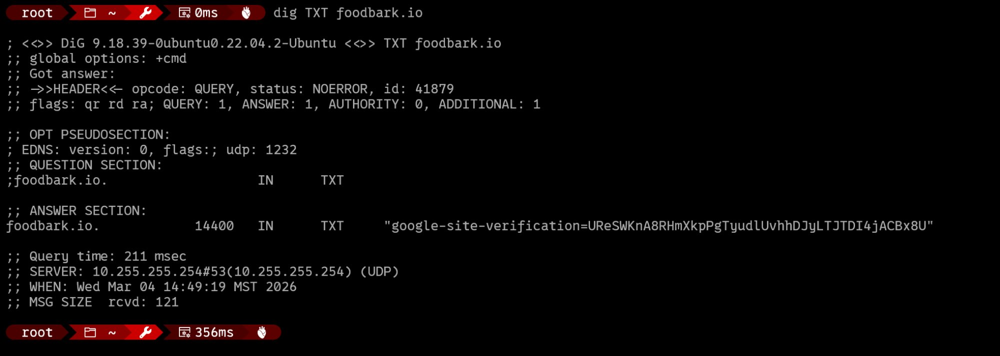
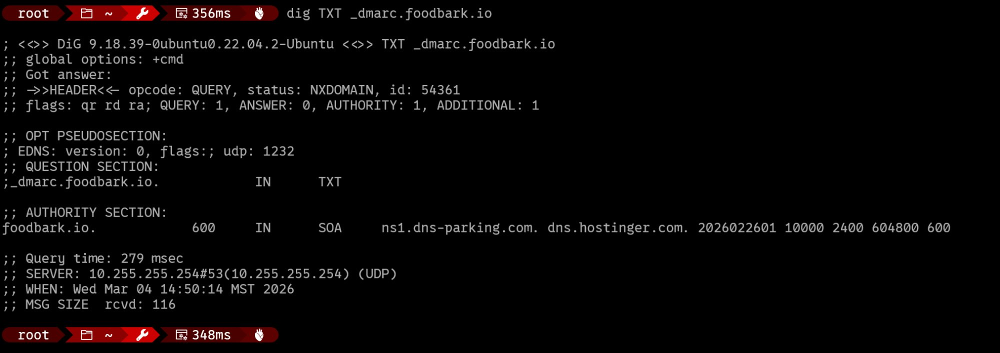
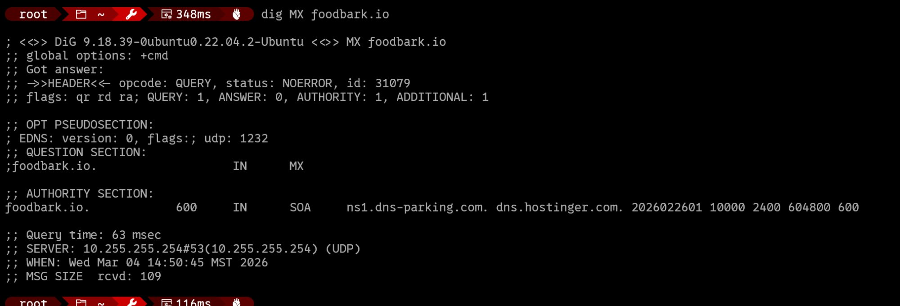

The results show foodbark.io has:
- **No SPF record** — no list of authorized sending servers
- **No DMARC record** — `NXDOMAIN`, the record doesn't even exist
- **No MX record** — no mail server configured at all

This domain is completely unprotected. Anyone can send email claiming to be from
`anything@foodbark.io` and receiving mail servers have no instructions to reject it.

---

### Step 2: Find the Target Inbox's Mail Server

To deliver the spoofed email we need to know which server accepts mail for the
recipient's domain. Look up the MX record:

```bash
dig MX art-educational.com
```

This returns `mail.protonmail.ch` — Protonmail's incoming mail server. That's where
we point swaks.

---

### Step 3: Send the Spoofed Email

```bash
swaks --to foodbark@art-educational.com --from "rex@foodbark.io" --ehlo "mail.foodbark.io" --header "From: Rex the Dog <rex@foodbark.io>" --header "Subject: SUPER Urgent Squirrel Update" --server mail.protonmail.ch:25 --body "SUPER URGENT: Woof woof! This is Rex again. The squirrels are now in the front yard. Woof."
```

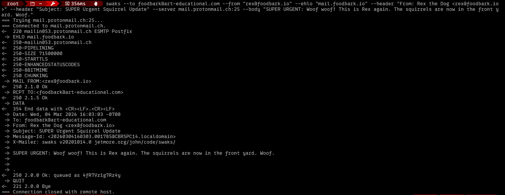

**What each flag does:**

| Flag | Purpose |
|------|---------|
| `--to` | SMTP envelope recipient — the actual delivery address |
| `--from` | SMTP envelope `MAIL FROM` — what SPF checks against |
| `--ehlo` | Spoofed hostname in the EHLO greeting |
| `--header "From:"` | Display name shown in the email client — independent of `--from` |
| `--header "Subject:"` | Overrides swaks' auto-generated subject line |
| `--server` | Which mail server to connect to directly |
| `--body` | Plain text message body |

---

### Step 4: The Result — Clean Delivery, No Warnings

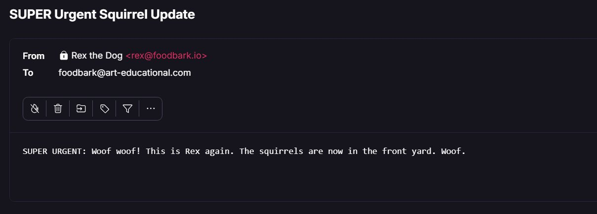

The email arrived showing `From: Rex the Dog <rex@foodbark.io>` with no warnings
whatsoever. From the recipient's perspective this looks completely legitimate. This
is exactly what a Business Email Compromise (BEC) attack looks like to a victim.

---

### Why This Works: The Envelope vs. Header Gap

SMTP was designed in 1982 with no built-in authentication. Every email has two
completely separate "from" fields:

```
SMTP Envelope  →  MAIL FROM:<rex@foodbark.io>
                  Used by servers for routing and SPF checks
                  Never shown to end users

Message Header →  From: Rex the Dog <rex@foodbark.io>
                  What email clients display to the recipient
                  Trivially fakeable with no verification
```

These two fields have **no required relationship to each other**. A receiving server
has no way to verify the connecting client is authorized to send as that domain —
unless the domain has published DNS records that say what to do.

---

## Part 2: The Fix — Adding DNS Records in Hostinger

### Step 1: Navigate to DNS Settings

Log into Hostinger, go to **Domains → your domain → Manage → DNS / Nameservers**.

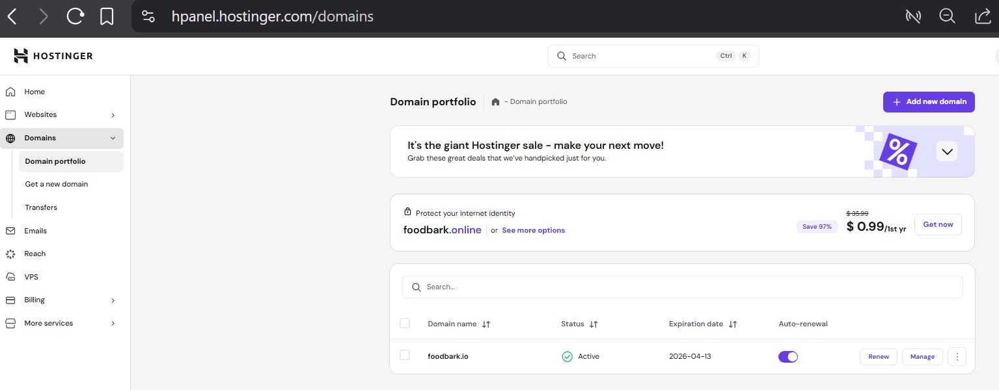
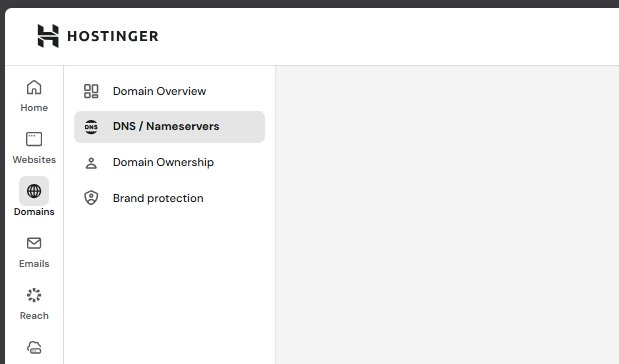

---

### Step 2: Add the SPF Record

**SPF** (Sender Policy Framework) declares which servers are authorized to send
email on behalf of your domain.

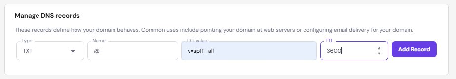

```
Type:   TXT
Name:   @
Value:  v=spf1 -all
TTL:    3600
```

**Every part explained:**

- `@` — applies to the root domain itself
- `v=spf1` — declares this is an SPF record, version 1
- `-all` — **hard fail**: no servers are authorized, reject everything. The `-` is
  critical — `~all` only soft-fails (marks suspicious but still delivers), `+all`
  allows everything (useless for protection)
- `3600` — TTL in seconds (1 hour). How long other DNS servers cache this record.
  Short enough that changes propagate within an hour if you ever need to update

Since foodbark.io has no legitimate mail servers, `-all` is correct. If protecting
a domain that sends real email via Google Workspace you would instead use:
`v=spf1 include:_spf.google.com -all`

---

### Step 3: Add the DMARC Record

**DMARC** (Domain-based Message Authentication Reporting and Conformance) ties SPF
and DKIM together and tells receiving servers what to **do** when checks fail.
Without DMARC, even a failed SPF check might still result in delivery.

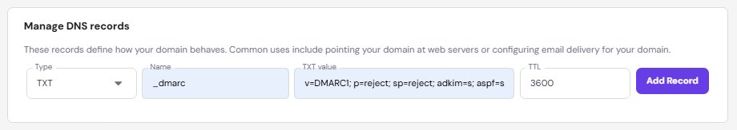

```
Type:   TXT
Name:   _dmarc
Value:  v=DMARC1; p=reject; sp=reject; adkim=s; aspf=s;
TTL:    3600
```

**Every part explained:**

- `_dmarc` — DMARC always lives on this exact subdomain. This is a fixed convention
- `v=DMARC1` — declares this is a DMARC record
- `p=reject` — the **policy**: tells receiving servers to outright reject mail from
  this domain that fails authentication. Options: `none` (monitor only),
  `quarantine` (spam folder), `reject` (block entirely). We use `reject` because
  this domain sends no legitimate email
- `sp=reject` — applies the same policy to all subdomains. Without this, subdomains
  fall back to `p=none`
- `adkim=s` — DKIM alignment **strict**: the DKIM signature domain must exactly
  match the `From:` header domain
- `aspf=s` — SPF alignment **strict**: the `MAIL FROM` envelope domain must exactly
  match the `From:` header domain. This directly closes the envelope-vs-header gap
- `3600` — TTL, same as SPF

---

### Step 4: Add the DKIM Null Record

**DKIM** (DomainKeys Identified Mail) uses cryptographic signatures to verify a
message was sent by an authorized server. Since foodbark.io has no mail server,
we publish a null record to explicitly declare that no valid DKIM keys exist.

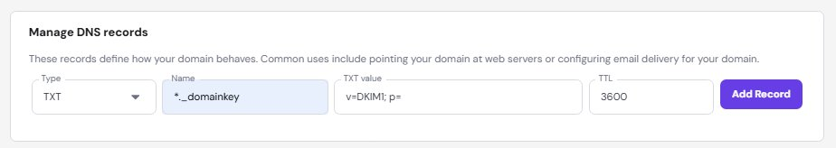

```
Type:   TXT
Name:   *._domainkey
Value:  v=DKIM1; p=
TTL:    3600
```

**Every part explained:**

- `*._domainkey` — wildcard covering all DKIM selectors for this domain. Selectors
  are identifiers like `google`, `default`, or `mail` that providers use to look up
  the right signing key
- `v=DKIM1` — declares this is a DKIM record
- `p=` — **empty public key**: explicitly signals no valid key exists. Any message
  claiming a DKIM signature from this domain should be treated as invalid
- `3600` — TTL

---

### Step 5: Verify the Records Propagated

```bash
dig TXT foodbark.io
dig TXT _dmarc.foodbark.io
```

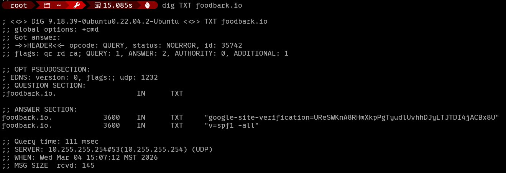
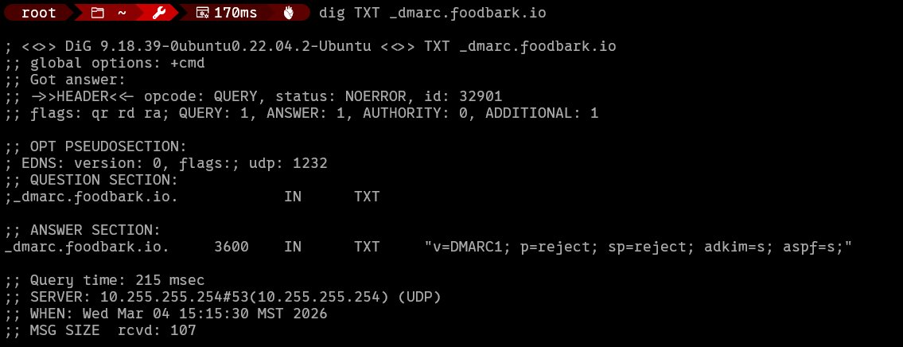

Both records are live with TTL 3600. The domain is now protected.

---

## Part 3: Confirming the Fix Works

Send the exact same spoofed email again and check the result:

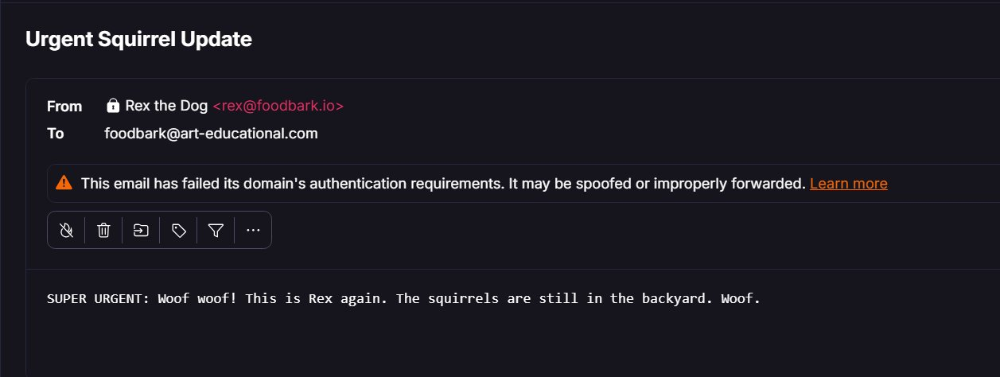

Now Protonmail shows:
- The sender address displayed in **red/orange**
- An explicit warning banner: **"This email has failed its domain's authentication
  requirements. It may be spoofed or improperly forwarded."**

**Before records:** clean delivery, no warnings, indistinguishable from legitimate mail.  
**After records:** hard visual warning flagging the message as a likely spoof.

---

## Important Caveat: DMARC Enforcement Depends on the Receiving Server

DMARC only works if the **receiving** server enforces it. Major providers like
Protonmail, Gmail, and Office 365 enforce DMARC strictly. Smaller or self-hosted
mail servers often ignore DMARC entirely and deliver anyway. This is the receiving
server's problem — your records are correctly configured. You've done everything
possible as the domain owner.

---

## Summary: Three Records That Protect Your Domain

| Record | Name | Value | What It Does |
|--------|------|-------|-------------|
| SPF | `@` | `v=spf1 -all` | Declares no servers authorized to send |
| DMARC | `_dmarc` | `v=DMARC1; p=reject; sp=reject; adkim=s; aspf=s;` | Reject anything that fails |
| DKIM null | `*._domainkey` | `v=DKIM1; p=` | Invalidates any claimed signatures |

---

*Lab performed in a controlled environment on domains owned by the author.
All test emails were sent to inboxes owned by the author with no third parties affected.*
